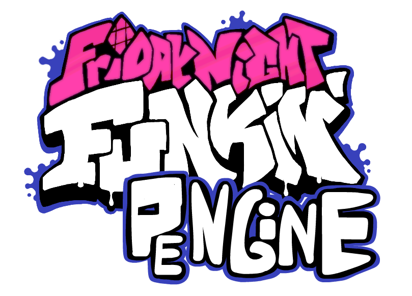

# Friday Night Funkin': PiEngine
## This is a re-release of PEngine!
The sort of prototype to Warmed Psych Engine... whiiich was later made into Psych Online <br>
This is a re-release of the old PEngine source code from 2022 (yes I know the source code is BAD, BADLY written)
<!-- <p align="center">
  
</p> -->

# PiEngine

Engine made mainly to improve vanilla client and give more freedom to multiplayer modding. <br>
To start Modding check out [The Wiki!](https://github.com/Snirozu/Funkin-PiEngine/wiki)
## Setting Shit up
1. Install [Haxe](https://haxe.org/download/) and [HaxeFlixel](https://haxeflixel.com/documentation/install-haxeflixel/) or if you already have installed update Haxe and HaxeFlixel to latest version so it doesn't throw exceptions when compiling
2. Run [InstallLibraries.bat](https://raw.githack.com/Snirozu/Funkin-PiEngine/main/art/installLibraries.bat) or install these libraries using Command Line:
``` bat
haxelib install flixel-addons
haxelib install flixel-ui
haxelib install hscript
haxelib git discord_rpc https://github.com/Aidan63/linc_discord-rpc
haxelib install openfl-webm
haxelib git yaml https://github.com/Snirozu/haxe-yaml.git
haxelib install linc_luajit
haxelib install udprotean
haxelib git linc_clipboard https://github.com/josuigoa/linc_clipboard.git
haxelib install markdown
```
3. And to compile just type ```lime test windows -debug``` or ```lime test windows``` in current folder command line

Also the source code for update unzipper is [here](https://github.com/Snirozu/Funkin-PiEngine-Unzipper) <br>
## Nice Stuff / Features
* LAN Multiplayer
* Action Notes
* Custom Skins (no need to change character in chart editor!)
* Make mods without touching code
* 5K to 9K Mania Support
* Modcharts
* Configs are in YAML instead of JSON so it is easier to read them
* Dialogue Cutscenes
* [Lua Support](https://github.com/Snirozu/Funkin-PiEngine/wiki/Lua-Documentation)
* Version Updater
* Custom Keybinds
* Some fixes / improvements to Vanilla
## NFAQ (not frequently asked questions)
### What is this engine different from others?
1. The character / stage configs are stored in yaml instead of json so they are more readable
2. It's easier to add more songs to the game just copy folders from songs/ and data/ into mods/songs and you just have imported a mod from another engine without editing any files
3. LAN MULTIPLAYERRRRRRRRRRR
4. Crash Handler
5. Easy to add skins without changing the character in chart editor
6. You can change the dimness and blur of game background
7. You can copy and paste shit to text boxes instead of typing them manually
8. Songs are stored only in songs/ instead of songs/ and data/
9. There's, stage editor so you don't need to touch the source code or lua
10. 4K to 9K mania support
11. In-Game Version Updater
12. In-Song Options
### Game crashess!!!111
Report it on https://github.com/Snirozu/Funkin-PiEngine/issues
### Input did not removed hitted note
Try pressing Remove Cloned Notes button in chart editor
## Credits
### PiEngine
- [Snirozu](https://snirozu.newgrounds.com/) - PiEngine Programmer
### Special Thanks
- [PolybiusProxy](https://github.com/brightfyregit/Friday-Night-Funkin-Mp4-Video-Support) - Video Loader for Flixel
- [gedehari and Shadow Mario](https://github.com/ShadowMario/FNF-PsychEngine/blob/f4cf818dac20859fd0223206609ba91b6818831f/source/editors/ChartingState.hx#L2022) - Waveform for Flixel
### Friday Night Funkin'
- [ninjamuffin99](https://twitter.com/ninja_muffin99) - Programmer
- [PhantomArcade3K](https://twitter.com/phantomarcade3k) and [Evilsk8r](https://twitter.com/evilsk8r) - Artists
- [Kawaisprite](https://twitter.com/kawaisprite) - Musician
